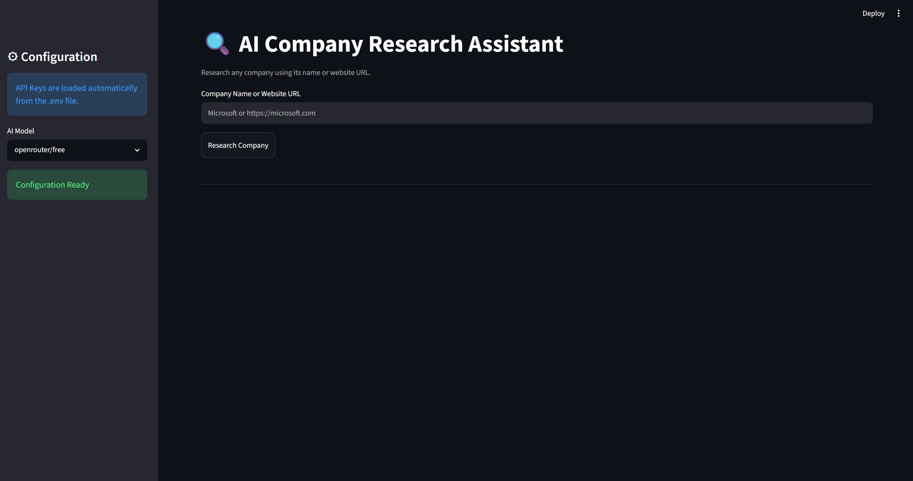
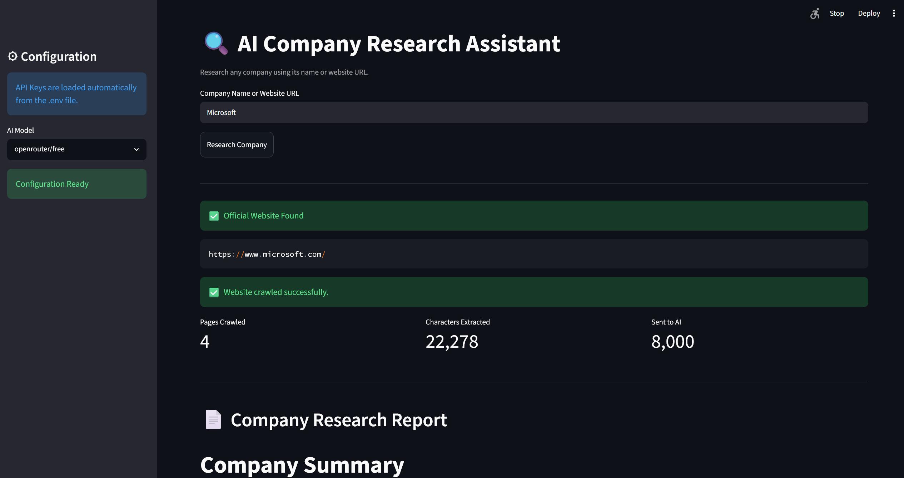
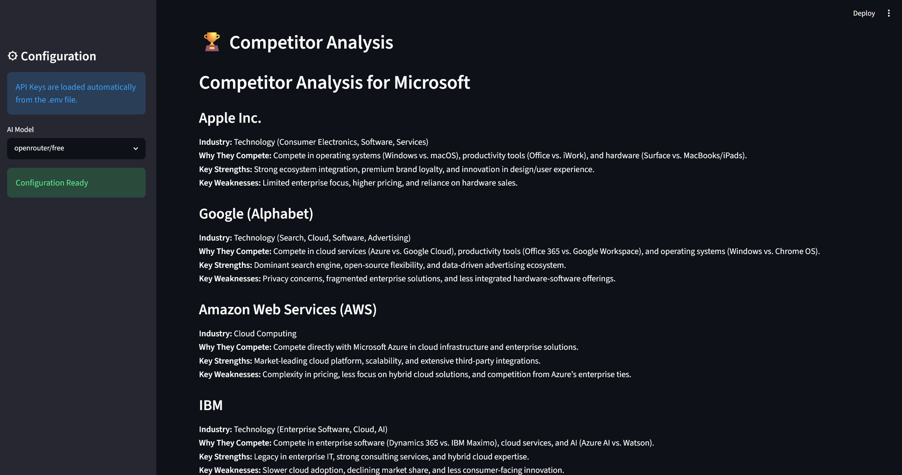
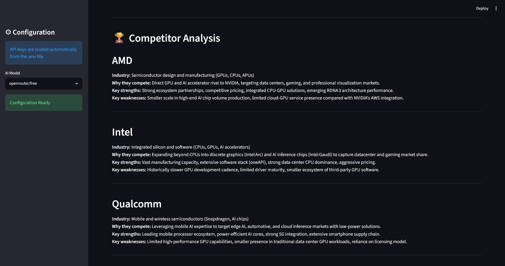

# 🔍 AI Company Research Assistant

An AI-powered web application that researches companies by automatically discovering their official website, crawling key pages, and generating a professional business report using Large Language Models (LLMs).

Built with **Streamlit**, **OpenRouter**, **Serper API**, and **BeautifulSoup**.

---

## 🚀 Features

- 🔎 Search companies using their name
- 🌐 Automatically discover the official company website
- 🕷️ Crawl multiple important pages
- 🤖 Generate AI-powered company research reports
- 🏆 Analyze competitors
- 📄 Export reports as PDF
- 🎨 Clean and responsive Streamlit interface
- 🔒 Environment variable support with `.env`

---

## 🛠 Tech Stack

- Python
- Streamlit
- OpenRouter API
- OpenAI SDK
- Serper API
- Requests
- BeautifulSoup4
- ReportLab

---

## 📂 Project Structure

```
company-research-assistant/
│
├── assets/
│   ├── home.png
│   ├── microsoft-report.png
│   ├── microsoft-competitors.png
│   ├── nvidia-report.png
│   ├── nvidia-competitors.png
│   └── pdf-report.png
│
├── services/
│   ├── crawler.py
│   ├── openrouter.py
│   ├── pdf_generator.py
│   ├── competitors.py
│   └── serper.py
│
├── utils/
│
├── app.py
├── requirements.txt
├── README.md
└── .gitignore
```

---

## ⚙️ Installation

Clone the repository

```bash
git clone https://github.com/YOUR_USERNAME/company-research-assistant.git
```

Move into the project

```bash
cd company-research-assistant
```

Create a virtual environment

```bash
python -m venv .venv
```

Activate it

### Windows

```bash
.venv\Scripts\activate
```

### macOS / Linux

```bash
source .venv/bin/activate
```

Install dependencies

```bash
pip install -r requirements.txt
```

---

## 🔑 Environment Variables

Create a `.env` file in the project root.

```env
OPENROUTER_API_KEY=your_openrouter_api_key
SERPER_API_KEY=your_serper_api_key
```

---

## ▶️ Run the Application

```bash
streamlit run app.py
```

---

## 📸 Screenshots

### Home Page



---

### Microsoft Research Report



---

### Microsoft Competitor Analysis



---

### NVIDIA Research Report


---

### NVIDIA Competitor Analysis



---

### PDF Export


---

## 📄 How It Works

1. Enter a company name.
2. Search the web for the official company website.
3. Crawl important pages such as About, Products, Services, and Contact.
4. Extract and clean website content.
5. Generate an AI-powered company research report.
6. Analyze competitors.
7. Export the report as a PDF.

---

## 🚀 Future Improvements

- Company logo extraction
- Financial analysis integration
- Interactive charts and dashboards
- Multi-language support
- DOCX export
- Enhanced PDF formatting
- Advanced website crawling

---

## 📜 License

This project is licensed under the MIT License.

---

## 👨‍💻 Author

**Shubham K**

GitHub: https://github.com/ShubhamKabir